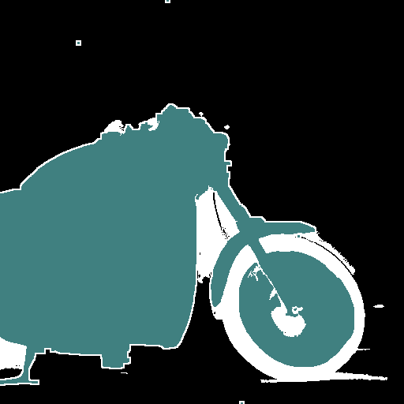
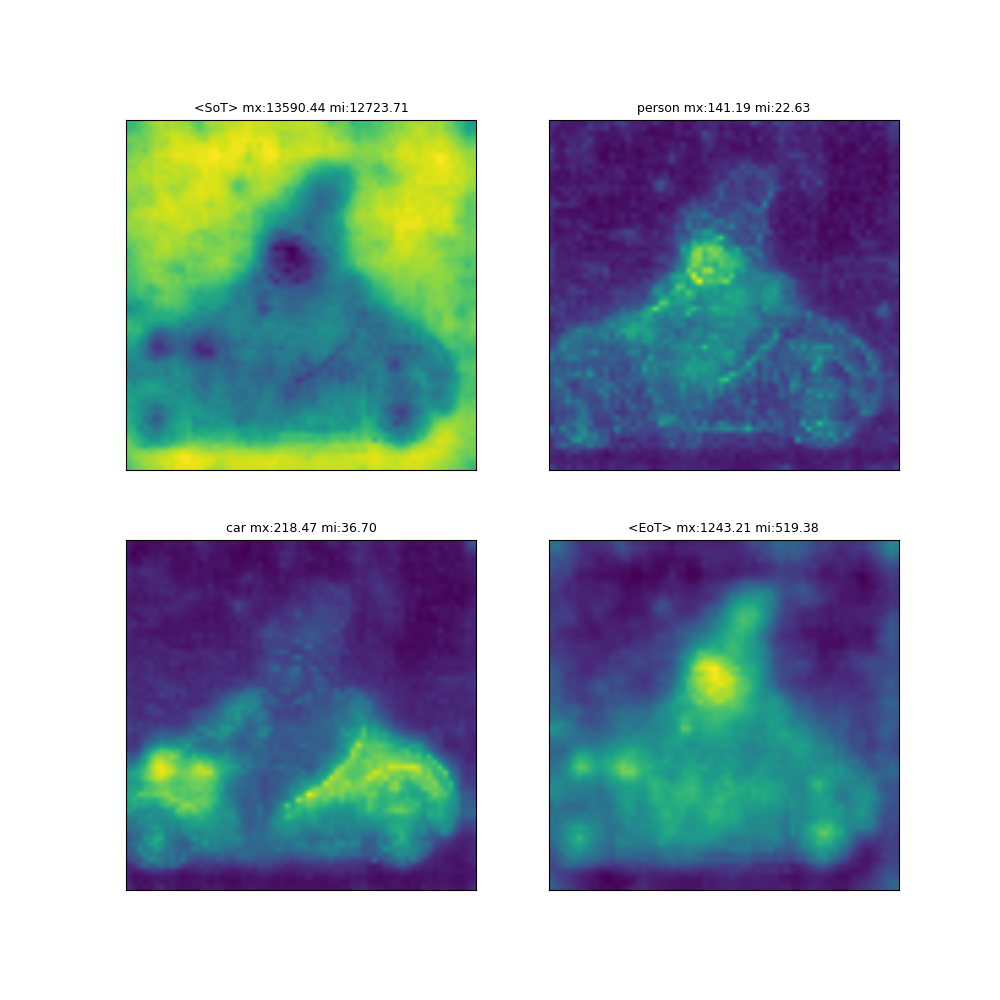
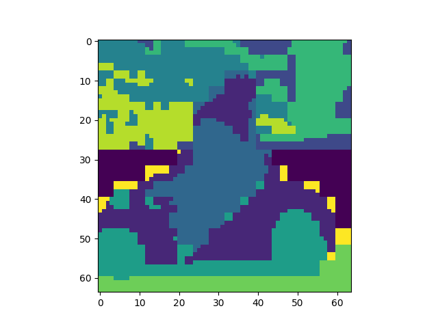
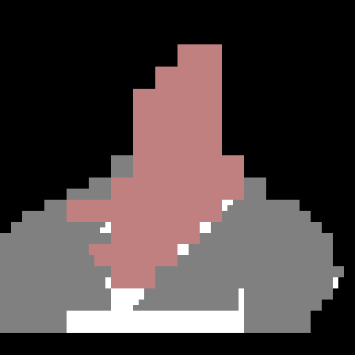
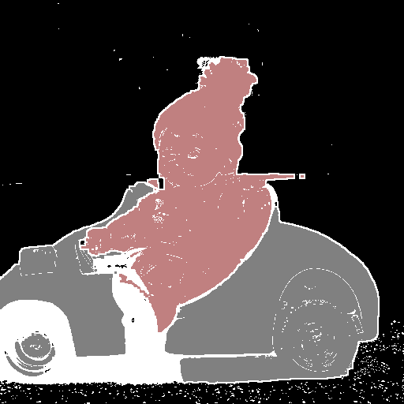

# PCC Segmentation 

This is the README for the Syntagen challenge submission: PCC Segmentation (Principal Component Clustering Segmentation). 

Install `ovam` in editable mode, environment configuration is in requirements.txt but not all is needed.

Take our 'ovam': we have made some changes to `ovam`( https://github.com/vpulab/ovam ) to store and write self-attention maps and added a custom `StableDiffusionHookercustom` to do so.

Submitted dataset:https://drive.google.com/file/d/1UseESW6RfyepWraDITINzaPICO3w9GAw

Submitted checkpoint:https://drive.google.com/file/d/1zswDG1Ez1eHp893HK04LygHpypZABtYG

  
  

# Execute for dataset generation:

1.) `python 01_datagen_pipeline.py`
-> new directory is generated under /work_dirs
takes approximately 48 compute hours for 10k prompts

2.) `python 02_clustering_and_classification.py work_dirs/"new_generated_work_dir"`

3.) `python 03_image_mask_refinement.py work_dirs/"new_generated_work_dir"`

-> copy image and refined mask (rename to mask) folder into a new folder and create the train.txt

# Explanation
Our approach is based on three different steps that are separated into three different scripts for reusability, but they can be combined into one script.

1. **Data generation/collection**
   - `01_datagen_pipeline.py`
   - Prompts from Dataset-Diffusion are used (format parsed slightly different) and Inputed into StableDiffusion (2.1 is used for submission dataset)
   - This script gets activations classwise from `ovam` and performs PCA (3 components) on every self-attention map from the UNet layers (only "Up" layers are used further)

   output: 

   1.) active_work_dir/image/img_{prompt_id}.jpg (stable diffussion output image)

   2.) active_work_dir/activation_data/attentionmap_{prompt_id}_descriptive.pickle (Ovam text tokens cross attention)

   3.) active_work_dir/cluster_data/cluster_{prompt_id}_all_attention_pca.pickle (self attention maps from unet layers)

  
  
  

2. **Class-agnostic clustering and mask classification**
   - `02_clustering_and_classification.py`
   - Several confidences and number of clusters are choosen and applied on the generated clusters from the pcas of the unet layers and intersection with the activations
   - output: active_work_dir/blocky_mask/img_{prompt_id}.png
 

  

3. **Image-level based refinement**
   - `03_image_mask_refinement.py`
   - use clustering over direct image features to refine the blocky masks
   - output: active_work_dir/refined_mask/img_{prompt_id}.png
 

  

Special Thanks:

Dataset-Diffusion:https://github.com/VinAIResearch/Dataset-Diffusion

OVAM:https://github.com/vpulab/ovam