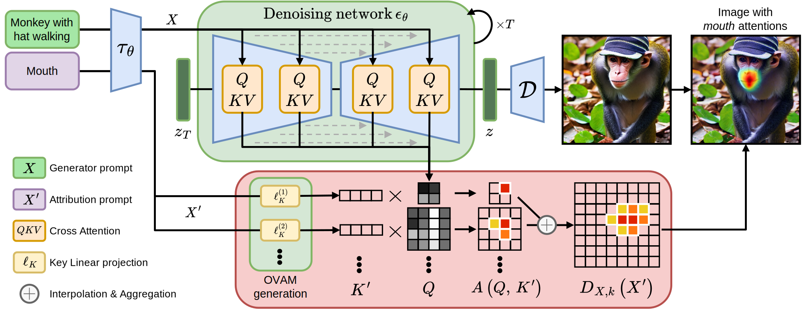

# Open-Vocabulary Attention Maps (OVAM)

**Open-Vocabulary Attention Maps with Token Optimization for Semantic Segmentation in Diffusion Models**


[](https://arxiv.org/abs/2403.14291)
[](https://cvpr.thecvf.com/)


In [this paper](https://arxiv.org/abs/2403.14291), we introduce *Open-Vocabulary Attention Maps (OVAM)*, a training-free extension for text-to-image diffusion models to generate text-attribution maps based on open vocabulary descriptions. Additionally, we introduce a token optimization process for the creation of accurate attention maps, improving the performance of existing semantic segmentation methods based on diffusion cross-attention maps.




## Installation

Create a new virtual or conda environment (if applicable) and activate it. For example, using `venv`:

```bash
# Install a Python environment (ensure 3.8 or higher)
python -m venv venv
source venv/bin/activate
pip install --upgrade pip wheel
```

Install PyTorch with a compatible CUDA or other backend and [Diffusers 0.20](https://pypi.org/project/diffusers/0.20.2/). In our experiments, we tested the code on Ubuntu with CUDA 11.8 and on MacOS with an MPS backend.

```bash
# Install PyTorch with CUDA 11.8
pip install torch==2.1.0 torchvision==0.16.0 torchaudio==2.1.0 --index-url https://download.pytorch.org/whl/cu118
```

```bash
# Or Pytorch with MPS backend for MacOS
pip install torch==2.1.0 torchvision==0.16.0 torchaudio==2.1.0
```

Clone project's code and install dependencies

```bash
git clone git@github.com:vpulab/ovam.git
cd ovam
pip install . # or `pip install -e .` for live installation
```

Or directly from GitHub

```bash
pip install git+https://github.com/vpulab/ovam.git
```

## Getting started

The Jupyter notebook [examples/getting_started.ipynb](./examples/getting_started.ipynb) contains a full example of how to use OVAM with Stable Diffusion. In this section, we will show a simplified version of the notebook.

### Setup
Import related libraries and load Stable Diffusion:

```python
import torch
import matplotlib.pyplot as plt
from diffusers import StableDiffusionPipeline
from ovam.stable_diffusion import StableDiffusionHooker
from ovam.utils import set_seed

pipe = StableDiffusionPipeline.from_pretrained("runwayml/stable-diffusion-v1-5")
pipe = pipe.to("mps") #mps, cuda, ...
```

Generate an image with Stable Diffusion and store the attention maps using OVAM hooker:

```python
with StableDiffusionHooker(pipe) as hooker:
    set_seed(123456)
    out = pipe("monkey with hat walking")
    image = out.images[0]
```
### Generate and attention map with open vocabulary

Extract attention maps for the attribution prompt `monkey with hat walking and mouth`:

```python
ovam_evaluator = hooker.get_ovam_callable(
    expand_size=(512, 512)
)  # You can configure OVAM here (aggregation, activations, size, ...)

with torch.no_grad():
    attention_maps = ovam_evaluator("monkey with hat walking and mouth")
    attention_maps = attention_maps[0].cpu().numpy() # (8, 512, 512)
```

Eight attention maps have been generated for the tokens:  `0:<SoT>, 1:monkey, 2:with, 3:hat, 4:walking, 5:and, 6:mouth, 7:<EoT>`. Plot attention maps for words `monkey`, `hat` and `mouth`:

```python
# Get maps for monkey, hat and mouth
monkey = attention_maps[1]
hat = attention_maps[3]
mouth = attention_maps[6]

# Plot using matplotlib
fig, (ax0, ax1, ax2, ax3) = plt.subplots(1, 4, figsize=(20, 5))
ax0.imshow(image)
ax1.imshow(monkey, alpha=monkey / monkey.max())
ax2.imshow(hat, alpha=hat / hat.max())
ax3.imshow(mouth, alpha=mouth / mouth.max())
plt.show()
```
Result (matplotlib code simplified, full in [examples/getting_started.ipynb](./examples/getting_started.ipynb)):


### Token optimization

The OVAM library includes code to optimize the tokens to improve the attention maps. Given an image generated with Stable Diffusion using the text `a photograph of a cat in a park`, we optimized a cat token for obtaining a mask of the cat in the image (full example in the notebook).


This token can be later used for generating a mask of the cat in other testing images. For example, in this image generated with the text `cat perched on the sofa looking out of the window`.


### Different Stable Diffusion versions

The current code has been tested with Stable Diffusion 1.5, 2.0 base, and 2.1 in Diffusers 0.20. We provide a module ovam/base with utility classes to adapt OVAM to other Diffusion Models.

## Data

The datasets used in the experiments section can be found at [to be published](http://www-vpu.eps.uam.es/webvpu/es/recursos-publicos/datasets/).

## Aknowledgements

We want to thank the authors of [DAAM](https://github.com/castorini/daam), [HuggingFace](https://huggingface.co/docs/diffusers/index), [PyTorch](https://pytorch.org/), RunwayML ([Stable Diffusion 1.5](https://huggingface.co/runwayml/stable-diffusion-v1-5)), [DatasetDM](https://github.com/showlab/DatasetDM), [DiffuMask](https://github.com/weijiawu/DiffuMask) and [Grounded Diffusion](https://github.com/Lipurple/Grounded-Diffusion).

## Citation

> Pending publication.
